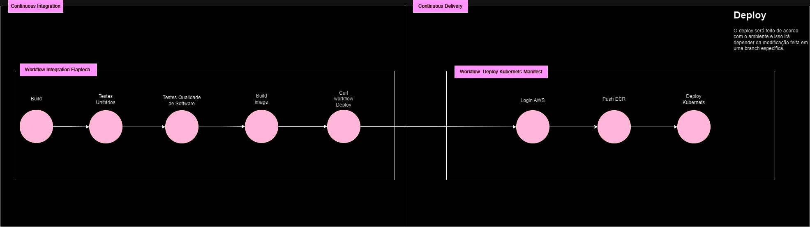

# kubernates
Repositório Kubernates manifest que gera os deploys dos projetos no cluste EKS na Amazon, segue abaixo como fizemos com o deploy do projeto fiaptech.

Cada diretório terá o respectivo código em kubernetes para deploy de sua respectiva aplicação, irá conter, configmap, secrets, loadbalance, volumes, sevices, HPA préviamente configurados dependendo da aplicação.

### Link Github
https://github.com/brunoblauzius-fiap/kubernetes-manifest

Video 1 CI: https://www.loom.com/share/baf428c5c69c4b53b9d998ca6be32de7?sid=eaccafd8-5312-4f7a-b220-f6bd4910c01b

Video 2 CD: https://www.loom.com/share/895cb50cf6044754995874c3a93aa114?sid=6cfd6ba5-00dc-4bfb-8a6b-ab88bc45fcf6

Video 3 Proteção de Branchs: https://www.loom.com/share/df90c68cf35a4cd797845d94f1d2ae7a?sid=ed95c93a-cba8-4ed9-804e-1fb308a705ba